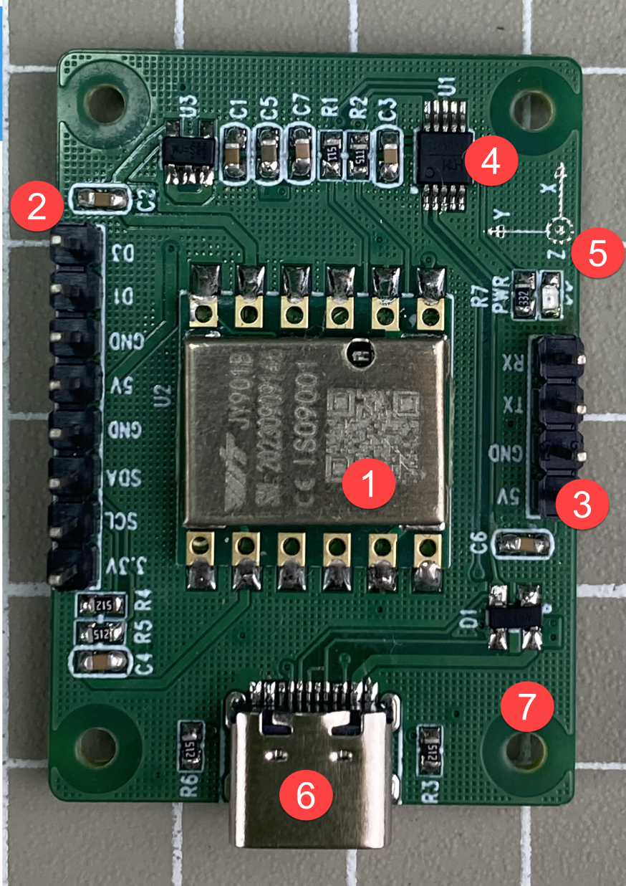
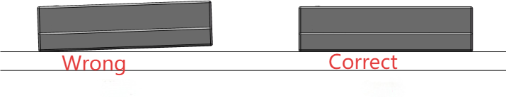
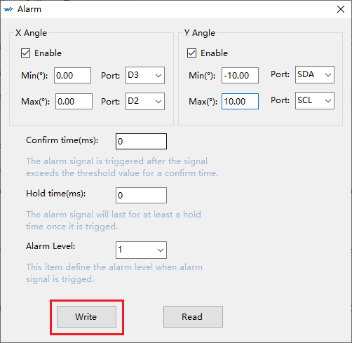
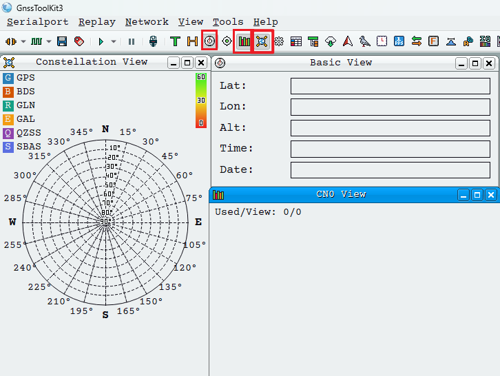

# 1. User Manual

The IMU module is a high-performance three-dimensional motion attitude measurement system based on MEMS technology. It includes a three-axis accelerometer, a three-axis electronic compass motion sensor and a barometer. By integrating various high-performance sensors and applying self-developed attitude dynamics core algorithm engines, along with high-dynamic Kalman filtering fusion algorithms, it offers customers high-precision, high-dynamic, real-time compensated three-axis attitude angles. Through flexible selection and configuration of various data types, diverse application scenarios can be satisfied.

The leading sensor fusion algorithm, based on Kalman filtering principle and possessing proprietary intellectual property, can provide real-time data data updates at rates as high as 200HZ, meeting various high-precision. Internally integrated within the product are independently developed high-precision calibration algorithms enhancing the measurement accuracy of the product.
At the same time, PC software, user manual, program files are available for your development, which minimizes the development time for various needs.

## 1.1 IMU Module Introduction

### 1.1.1 The front Side of Module

(1) The core module group of IMU: all pose calculations are accomplished through this core module.

(2) External pin: connect to CPS modules or I2C devices.

(3) Serial port pin: the output of TTL signals enables communication with `STM32` and other microcontrollers.

(4) `CP2102` chip: USB to serial port functionality.

(5) Power indicator: module status indicator. In the normal circumstance, the indicator will keep lighting up.

(6) Type-C interface: connect to the module's serial port for communication purposes.

(7) Fixed copper column: use to install metal protection shell or GPS module

### 1.1.2 Pin Function Instruction

| **No.** | **Pin Function** |
|:--:|:--:|
| NC | None |
| D1 | Connect to the data port of GPS module |
| GND | GND |
| 5V | 5V |
| GND | GND |
| SDA | I2C-serial data cable |
| SCL | I2C-Serial clock line |
| 3V3 | 3.3V |
| RX | Serial port-data receiving pin |
| TX | Serial port-data sending pin |
| GND | GND |
| 5V | 5V |

### 1.1.3 The Back Side of Module

### 1.1.4 Version Difference

IMU module has two versions for your option, without or with the metal shell.

The latter one comes pre-installed with the metal shell, while the bare version can be connected to `STM32` or other microcontrollers via serial port and can also be connected to a Raspberry Pi with a USB cable. Once the metal shell is installed, only USB communication can be used.

### 1.1.5 Product Features

(1) The module integrates high-precision gyroscope, accelerometer, magnetometer, and barometer. It utilizes high-performance microprocessors and advanced kinematic algorithms alongside Kalman dynamic filtering techniques to swiftly determine the module's current real-time motion attitude.

(2) It employs advanced digital filter techniques to effectively reduce measurement noise and enhance measure accuracy.

(3) Internally integrating with an attitude estimator, combined with a dynamic Kalman filtering algorithm, it enables outputting its current attitude in dynamic environments. The static attitude measurement accuracy is 0.05 degrees, dynamic accuracy is 0.1 degrees, showcasing extremely high stability. Its performance even surpasses certain professional inclinometers.

(4) The integration of a magnetometer sensor for filtering and fusing the Z-axis heading angle. It resolves the cumulative error caused by gyroscope integration drift in the 6-axis algorithm, ensuring stable output of heading angle data over long periods.

:::{Note}
Due to magnetic field detection, calibration is required before use. During operation, it's necessary to stay away from magnetic interference areas, electronic devices, magnets, speakers, and other hard magnetic objects at a distance of at least 20cm.
:::

(5) The module comes with an internal voltage stabilizing circuit, operating at a voltage range of 3.3 to 5V. The pin level compatible with embedded systems of 3.3V/5V, allowing for easy connectivity. It supports two types of digital interfaces: serial port and IIC, enabling users to choose the optimal connection method. The serial port speed is adjustable from 4800bps to 921600bps, while the I2C interfaces supports a full speed of 400Kbps.

(6) The data output rate is up to 200Hz. The output content can be freely selected, with an adjustable output rate ranging from 0.2 to 200Hz. It retains four expansion port, each of which can be configured for various functions such as analog input, digital input, or digital output.

(7) Equipped with GPS connectivity. It is capable of receiving serial GPS data compliant with the NMEA-0183 standard, forming a GPS-IMU integrated navigation unit.

### 1.1.6 Parameter Index

* **Accelerometer Parameters**

<table border="1" class="docutils" style="width:520px;table-layout: fixed;">
<thead>
<tr>
<th style="text-align: center;"><strong>Parameter</strong></th>
<th style="text-align: center;"><strong>Condition</strong></th>
<th style="text-align: center;"><strong>Typ</strong></th>
</tr>
</thead>
<tbody>
<tr>
<td style="text-align: center;">Range</td>
<td style="text-align: center;"></td>
<td style="text-align: center;">±16g</td>
</tr>
<tr>
<td style="text-align: center;">Resolution</td>
<td style="text-align: center;">±16g</td>
<td style="text-align: center;">0.0005(g/LSB)</td>
</tr>
<tr>
<td style="text-align: center;">RMS noise</td>
<td style="text-align: center;">Band width=100Hz</td>
<td style="text-align: center;">0.75~1mg-rms</td>
</tr>
<tr>
<td style="text-align: center;">Static zero drift</td>
<td style="text-align: center;">Horizontal placement</td>
<td style="text-align: center;">±20~40mg</td>
</tr>
<tr>
<td style="text-align: center;">Temperature excursion</td>
<td style="text-align: center;">-40°C ~ +85°C</td>
<td style="text-align: center;">±0.15mg/℃</td>
</tr>
<tr>
<td style="text-align: center;">Band width</td>
<td style="text-align: center;"></td>
<td style="text-align: center;">5~256Hz</td>
</tr>
</tbody>
</table>

* **Gyroscope Parameters**

<table border="1" class="docutils" style="width:520px;table-layout: fixed;">
<thead>
<tr>
<th style="text-align: center;"><strong>Parameter</strong></th>
<th style="text-align: center;"><strong>Condition</strong></th>
<th style="text-align: center;"><strong>Typ</strong></th>
</tr>
</thead>
<tbody>
<tr>
<td style="text-align: center;">Range</td>
<td style="text-align: center;"></td>
<td style="text-align: center;">±2000°/s</td>
</tr>
<tr>
<td style="text-align: center;">Resolution</td>
<td style="text-align: center;">±2000°/s</td>
<td style="text-align: center;">0.061(°/s)/(LSB)</td>
</tr>
<tr>
<td style="text-align: center;">RMS noise</td>
<td style="text-align: center;">Band width=100Hz</td>
<td style="text-align: center;">0.028~0.07(°/s)-rms</td>
</tr>
<tr>
<td style="text-align: center;">Static zero drift</td>
<td style="text-align: center;">Horizontal placement</td>
<td style="text-align: center;">±0.5~1°/s</td>
</tr>
<tr>
<td style="text-align: center;">Temperature excursion</td>
<td style="text-align: center;">-40°C ~ +85°C</td>
<td style="text-align: center;">±0.005~0.015 (°/s)/℃</td>
</tr>
<tr>
<td style="text-align: center;">Band width</td>
<td style="text-align: center;"></td>
<td style="text-align: center;">5~256Hz</td>
</tr>
</tbody>
</table>

* **Magnetometer Parameters**

<table border="1" class="docutils" style="width:520px;table-layout: fixed;">
<thead>
<tr>
<th style="text-align: center;"><strong>Parameter</strong></th>
<th style="text-align: center;"><strong>Condition</strong></th>
<th style="text-align: center;"><strong>Typ</strong></th>
</tr>
</thead>
<tbody>
<tr>
<td style="text-align: center;">Range</td>
<td style="text-align: center;"></td>
<td style="text-align: center;">±2Gauss</td>
</tr>
<tr>
<td style="text-align: center;">Resolution</td>
<td style="text-align: center;">±2Gauss</td>
<td style="text-align: center;">0.0667mGauss/LSB</td>
</tr>
</tbody>
</table>

* **Barometer Parameters**

<table border="1" class="docutils" style="width:520px;table-layout: fixed;">
<thead>
<tr>
<th style="text-align: center;"><strong>Parameter</strong></th>
<th style="text-align: center;"><strong>Condition</strong></th>
<th style="text-align: center;"><strong>Typ</strong></th>
</tr>
</thead>
<tbody>
<tr>
<td style="text-align: center;">Typ</td>
<td style="text-align: center;"></td>
<td style="text-align: center;">300~1100hPa</td>
</tr>
<tr>
<td style="text-align: center;">RMS noise</td>
<td style="text-align: center;">Standard mode</td>
<td style="text-align: center;">0.5Pa-RMS</td>
</tr>
<tr>
<td style="text-align: center;">Relative accuracy</td>
<td style="text-align: center;"></td>
<td style="text-align: center;">±0.06hPa</td>
</tr>
</tbody>
</table>

* **Pitch Angle and Roll Angle Parameters**

<table border="1" class="docutils" style="width:520px;table-layout: fixed;">
<thead>
<tr>
<th style="text-align: center;"><strong>Parameter</strong></th>
<th style="text-align: center;"><strong>Condition</strong></th>
<th style="text-align: center;"><strong>Typ</strong></th>
</tr>
</thead>
<tbody>
<tr>
<td style="text-align: center;">Range</td>
<td style="text-align: center;"></td>
<td style="text-align: center;">X:±180°，Y:±90°</td>
</tr>
<tr>
<td style="text-align: center;">Inclination accuracy</td>
<td style="text-align: center;">static</td>
<td style="text-align: center;">0.1°</td>
</tr>
<tr>
<td style="text-align: center;">Inclination accuracy</td>
<td style="text-align: center;">dynamic</td>
<td style="text-align: center;">0.5°</td>
</tr>
<tr>
<td style="text-align: center;">Resolution</td>
<td style="text-align: center;">Horizontal placement</td>
<td style="text-align: center;">0.0055°</td>
</tr>
<tr>
<td style="text-align: center;">Temperature excursion</td>
<td style="text-align: center;">-40°C ~ +85°C</td>
<td style="text-align: center;">±0.5~1°</td>
</tr>
</tbody>
</table>

* **Heading Angle Parameters**

| **Parameter** | **Condition** | **Typ** |
|:--:|:--:|:--:|
| Range | | Z:±180° |
| Heading accuracy | 9 axes algorithm, magnetic field calibration, dynamic/static | 1°（Under no magnetic field interference）【1】 |
| Heading accuracy | 6 axes algorithm, static | 0.5°（There is an accumulation of errors in dynamic integration）【2】 |
| Resolution | Horizontal placement | 0.0055° |

:::{Note}

* Prior to usage, conduct a magnetic field calibration in the testing environment to ensure that the sensors are familiar with the magnetic field in that environment. During calibration, please stay away from magnetic interference.
* In certain vibrational environments, there may be accumulated errors. The specific error cannot be estimated and is subject to actual testing for accuracy.
:::

### 1.1.7 Module Parameters

* **Basic Parameters**

| **Parameters** | **Comment** |
|:---|:--:|
| Serial communication port | The default baud rate is 9600bps, with adjustable range from 4800bps to 921600bps |
| I2C interface | The hardware I2C supports a maximum of 400KHz, while the software I2C supports a maximum of 100KHz |
| Output content | On-chip time, 3-axis acceleration, 3-axis angular velocity, 3-axis magnetic field, 3-axis orientation, quaternions, port status, air pressure, altitude |
| Output rate | The default is 10Hz, with adjustable value from 0.2Hz-200Hz |
| Startup time | 1000ms |
| Working temperature | -40℃~85℃ |
| Storage temperature | -40℃~100℃ |
| Impact resistance | 20kg（with metal shell） |

* **Electric Parameters**

| **Parameters** | **Condition** | **Value** |
|:--:|:--:|:--:|
| VCC supply voltage | | 3.3V/5V |
| Working currency | 5V | 12mA |
| Resting current | 5V | 15uA |

## 1.2 Metal Shell Installation

Following shows the installation holes of two versions of IMU module.

When installing IMU module onto other devices, to prevent errors caused by installation, please pay attention to the followings:

(1) Ensure that the IMU module's installation surface is completely flush with the surface being measured. The measured surface should be as horizontal as possible, without any angles or inclinations.

(2) There should be no angular difference between the bottom edge line of the IMU module and the axis line of the object being measured. Ensure that during installation, the bottom edge line of the IMU module remains horizontal or orthogonal to the axis line of the object being measured.

(3) The IMU module must be securely fixed and in close contact with the measured surface. After installation, connect it to PC software to check if it is table. If it's not stable, please calibrate the IMU module.

## 1.3 Notes

(1) The IMU module has two version available. If you purchase IMU module with metal shell, it comes pre-installed from the factory. Any soldering will affect the warranty for both versions.

(2) After powering on the IMU module, if the 3D model displayed on PC software shakes or responds sluggishly when rotating the module's Z-axis heading angle, please perform a magnetic calibration on the device using PC software.

(3) The control boards supporting USB communication such as Raspberry Pi and Jetson Nano, can directly be connected with the IMU module using `Type-C` cable. Microcontrollers like `STM32` or others that support serial port or I2C communication can be connected to the external pins of the IMU module.

(4) The default communicate baud rate of an IMU module is 9600bps. If the device connected does not support this communication rate, it can be adjusted to a range from 4800bps to 921600bps. Ensure that both devices have the same baud rate for communication to occur.

(5) If the IMU module fails to connect to PC software after connecting to computer's USB port, you need to ensure that the serial driver program has been installed.

(6) If the DI interface of the module connects to a GPS module to form an inertial navigation unit, the GPS module must output serial data following the NMEA-0183 standard. Additionally, the serial baud rate of the GPS should be set to 115200bps.

(7) Under the nine-axis algorithm, the Z-axis angle represents absolute orientation in reference to the East-North-Up coordinate system. It cannot be relatively zeroed out. When rotated to 0 degrees, the direction indicated by the Y-axis points towards the North.

## 1.4 The Usage of PC Software-Install Serial Port Driver

If you have installed `ch340` chip driver, you can skip the following content.

(1) Double-click the file ch341ser.exe located in this folder.

(2) Click Install.

## 1.5 The Usage of PC Software-Device Connection

### 1.5.1 Serial Port Connection

(1) Locate **MiniIMU.exe** in the extracted material "[**Appendix -> PC Software -> GnssToolKit3.zip**](Appendix.md)".

When you open the PC software, you can see the following prompt box. Please close it. If the IMU module is already connected, it will be automatically establish a connection.

(2) Enter and select the model name `JY901B`. If it is already set, please skip this step.

(3) Connect the IMU module to the computer using a USB-TypeC data cable. Then, click on the menu bar and select **'Auto Detect Devices'**.

(4) After successful connection, it will display **"Device detected"**, and you will observe changes in X-axis angle, Y-axis angle and Z-axis angle data. If the connection fails, please ensure that the serial driver has been connected or try using another USB port.

### 1.5.2 The Use of IMU Module

(1) The IMU module comes with pre-programmed with firmware. The current orientation of the module can be viewed on PC software. Clicking on **"3D"** will open a window, where an automobile model is displayed by default. As the orientation of the IMU module is altered, the model's orientation will correspondingly change to reflect the IMU's movements. The Y-axis represents the front of the car, and the IMU module should be placed with its Y-axis facing forward.

(2) The automobile model can also be replaced with an airplane model, a human head model, or a cube model. Holding down the left mouse button and dragging the model allows you to change its angle. Clicking **'Reset'** restores the view, while clicking the **'+'** key enlarges the model and the **'-'** key reduces its size.

## 1.6 The Usage of PC Software-Parameters Configuration Instruction

Prior to the following operation, please ensure that the IMU module has been connected to PC software.

### 1.6.1 Configuration Interface Instruction

Click on **"Config"** on menu bar. A window will pop up, then observe the status at the lower right corner. It must be **"On-offline"**, otherwise, **"Off-line"** indicates that the IMU module fails to connect.

* **System**

(1) Reset: restore the default configuration data of the IMU module.

(2) Sleep: enter the sleep mode. Click again to exit sleep mode.

(3) Alarm: through the PC software's alarm settings, you can configure the following pins as alarm output ports. Take the settings below as an example, under the normal circumstances, the four ports output a low level (0V). When the X or Y-axis angle value exceeds the maximum value of 10° or falls below the minimum value of -10°, the corresponding port outputs a high or low-level alarm. Click **'Write'** to apply the configuration.

(4) Algorithm: Selecting the six-axis option reads only the accelerometer and gyroscope data to calculate the attitude angle through sensor fusion. Opting for the nine-axis option includes magnetometer data for fusion-based attitude estimation. Prior to usage, please calibrate the IMU module's magnetometer data. Under the nine-axis algorithm, the Z-axis angle represents an absolute angle in the East-North-Up coordinate system and cannot be relatively zeroed out. When rotated to 0 degrees, the direction pointed by the Y-axis indicates the North direction.

(5) Installation Orientation: Horizontal and Vertical. The module's default installation orientation is horizontal. For vertical placement, use the vertical installation setting.

* **Calibration**

(1) Acceleration: calibrate the accelerometer.

(2) Magnetic Field: calibrate the magnetic field.

(3) Altitude: calibrate the altitude.

(4) Zero Z-axis Angle: effective only in the six-axis mode, set the relative heading angle to zero.

(5) Set Angle Reference: use the current attitude as a reference.

(6) Gyroscope Auto-Calibration: gyroscope automatic calibration switch.
For specific calibration methods, please refer to the next section [1.7 The Use of PC Software -Calibrate the IMU Module](#anchor_1_7).

* **Range**

(1) Bandwidth: Set the bandwidth for reading raw data, default is 20Hz.

(2) GPS Time Zone: Set the time zone for GPS. Effective only when connected to a GPS module

* **Content**

Configure the content of serial port output, which can be viewed for protocol file parsing data.

:::{Note}
Once **'GPS Raw'** is checked, the module will exclusively output raw GPS information, and other data will not be outputted. View the corresponding data in the **'Data'** section of the menu bar.
:::

* **Communication**

(1) Communication rate: the serial communication rate is 9600 by default, with an adjustable range from 4800 to 921600.

(2) Output rate: serial port data return rate. Default is 10Hz, adjustable from 0.2Hz to 200Hz. For 10Hz, it means transmitting 10 data packets per second. By default, transmitting one data packet consists of 11 bytes.

:::{Note}
* **"Single"** cannot be selected as it may prevent the automatic device monitoring function from establishing a connection.
* If a 200Hz data return rate is required, only three parameters can be selected, for example, 'Acceleration,' 'Angular Velocity,' and 'Angle.'
* If there's extensive return content and the communication baud rate is relatively low, it might not be possible to transmit all data. In such cases, the module will automatically lower the frequency and output at the maximum allowed rate. If the transmit rate is high, it's advisable to set a higher baud rate, usually around 115200.
:::

(3) Device Address: I2C device address, default at `0x50` and does not need modification.

* **Port**

(1) Set the expansion interface mode, with a total of four modes available. It is recommended to keep the default settings and no modification is necessary.

(2) `AIN`: Analog Input `DIN`: Digital Input `DOH`: Output High Level `DOL`: Output Low Level

## 1.7 The Use of PC Software-Calibrate IMU Module

Prior to the following operations, please ensure that the IMU module has been connected to PC software.

### 1.7.1 Calibrate Accelerometer

If you place the IMU module flat on a table or another surface and notice that **"Angle X"** and **"Angle Y"** are greater than 1°, it's necessary to calibrate the accelerometer.

Click on **"Configuration"** in the menu bar to open the configuration interface. Ensure the IMU module is placed flat. Click on **"Acceleration"**, and then click on **"Set Angle Reference"**.

At this point, `Angle X` and `Angle Y` will become close to 0°.

### 1.7.2 Calibrate Magnetic Field

After powering on the IMU module, if the 3D model displayed on the PC computer shakes or responds sluggishly when rotating the module's Z-axis heading angle, please perform magnetic field calibration using the PC software. Clicking on the **'Magnetic Field'** in the configuration interface to enter the calibration interface.

The magnetic field calibration has multiple methods, with the spherical fitting method being quite common. In the following operations, we'll use the spherical fitting method for demonstration.

You can click on **"Operating instructing"** to check the calibration steps (as shown in the figure above.).

You can also visit the following website to watch the calibration video:
[https://www.bilibili.com/video/BV1PG4y1K7SV/?spm_id_from=333.788.recommend_more_video.0&vd_source=237085b7da7254d04b8760fa9eb9ace1](https://www.bilibili.com/video/BV1PG4y1K7SV/?spm_id_from=333.788.recommend_more_video.0&vd_source=237085b7da7254d04b8760fa9eb9ace1)

* **Pre-calibration Preparation**

(1) Please turn on the compass on your phone and face yourself to the North or to the south.

(2) Hold the IMU module in your hand and hang it in the air, more than 10cm away from the plane where you placed it.

(3) Be mindful not to get too close to magnetic objects, stay away from computer speakers and iron objects as much as possible and preferably hold your hand in the air.
After completing the aforementioned preparation, click the **'Start Calibration'** button on the interface.

Wait for the initialization to complete and then you can start calibration.

(1) Y-axis calibration: watch the chartXZ change. Hold the IMU module horizontally and refer to the direction of the cell phone's compass to orient the Y-axis to the east (the positive direction of the Y-axis and the east of the geographic location are the same direction). Then slowly rotate around the Y-axis by more than 360° (It can be clockwise or counterclockwise, just keep the same direction).

When the blue data points in the chartXZ interface are distributed in the green ellipse line for a better fitting effect. In order to make the data more accurate, you can turn a few more times, and try to have a smooth and even speed in the process of flipping.

(2) X-axis calibration: watch the chartYZ change. Place the IMU module horizontally, refer to the direction of the cell phone's compass to orient the X-axis to the east, and then slowly rotate around the X-axis by more than 360° (It can be clockwise or counterclockwise, just keep the direction consistent).

 

When the blue data points in the chartYZ interface are distributed in the green ellipse line for a better fitting effect. In order to make the data more accurate, you can turn a few more times, and try to have a smooth and even speed in the process of turning.

(3) z-axis calibration: watch the chartXY change. Place the IMU module vertically, refer to the direction of the cell phone's compass to orient the Z-axis to the east, and then slowly rotate around the Z-axis by more than 360° (It can be clockwise or counterclockwise, just keep the direction consistent).

 

When the blue data points in the chartXY interface is distributed in the green ellipse line for a better fitting effect. In order to make the data more accurate, you can turn a few more times, and try to have a smooth and even speed in the process of flipping.

(4) After calibrating all three axes (XYZ), click on **'Finish Calibration'**:

:::{Note}
When calibrating the Y-axis, focus only on the data in chartXZ; the other two views also display data but are not essential. Similarly, this applies to the other two axes.
:::

The following image is an illustrative representation of the completion of the spherical fitting method for magnetometer calibration, provided for reference only

### 1.7.3 Calibrate Gyro

The gyroscope's automatic calibration feature is enabled by default and doesn't require additional settings. Just keep the gyroscope's automatic calibration feature enabled

* **Parameter Definitions**

(1) Gyroscopic Stillness Threshold: Gyroscopic sensors typically come with a bias, such as 0.5°/s. When the sensor doesn't eliminate this bias, the raw output data of angular velocity tends to fluctuate within the range of ±0.5°/s. If angular integration is performed at this stage, the angle will continuously drift over time due to this bias. To eliminate angular drift, a gyroscope bias calibration is introduced. The principle involves subtracting two adjacent angular velocity data values. When the difference is smaller than the set Gyroscopic Stillness Threshold and remains below this value for a certain duration (Gyroscopic Stability Time), the sensor is considered still. Calibration for bias begins at this point, taking the average of the angular velocity over a second as the bias. Subsequent data will be adjusted by subtracting this bias, bringing the gyroscope's data back to zero.

(2) Z-axis Stillness Threshold: When the Z-axis angular velocity (raw angular velocity minus bias value) is less than the set Z-axis Stillness Threshold and remains so for a certain duration (Z-axis Stability Time), the sensor is considered still.

① If you need to disable the gyroscope's automatic calibration feature, set the Z-axis Stillness Threshold to 0 and the Gyroscopic Stillness Threshold to 0.001 (0.001 is the default output of the sensor without bias calibration). The Stability Time does not need to be changed. Then re-read the sensor data to confirm the modifications have been successful and have taken effect. Once effective, the gyroscope's automatic calibration feature will be disabled

② When utilizing the gyroscope's automatic calibration feature, set the required stillness thresholds (default Z-axis Stillness Threshold is 0.3, and Gyroscopic Stillness Threshold is 0.000). When the module's angular velocity data exceeds the set value, it's considered in motion; when it falls below the set value, the sensor is considered still.

### 1.7.4 Calibrate Height

If the altitude data detected by the barometer appears to be abnormal, it might be necessary to calibrate the altitude. Barometric altitude measurements provide only approximate ranges and may not accurately determine precise altitude.

Prior to calibrating altitude, ensure the surrounding air pressure remains stable without influences from fans or airflow. Click on '**Configuration**' -> '**Altitude**' and wait for the calibration to complete

## 1.8 The Use of PC Software-Graphical Data Display

:::{Note}
All data that you wish to display graphically needs to be enabled by checking the corresponding data output in the menu bar under **'Configuration'** -> **'Content'**.
:::

### 1.8.1 Display Data

Click on **"Data"** to view all data.

### 1.8.2 Accelerometer Graphical Data Visualization

Click on the **"Acceleration"** interface. In the following icons, the blue solid line represents the data for the X-axis acceleration, the yellow solid line represents the data for the Y-axis acceleration, and the red solid line represents the data for the Z-axis acceleration. As the IMU inertial navigation device moves in different directions along its axes, the corresponding axis data will show offsets and will be displayed in real-time on the chart.

### 1.8.3 Gyroscope Graphical Data Visualization

Click on the **"Gyroscope"** interface. In the following icons, the blue solid line represents the data for the X-axis gyroscope, the yellow solid line represents the data for the Y-axis gyroscope, and the red solid line represents the data for the Z-axis gyroscope. As you tilt or rotate the IMU inertial navigation device, the corresponding axis data will show offsets and will be displayed in real-time on the chart.

### 1.8.4 Graphical Representation of Attitude Angles Data

Click on the **"Attitude Angles"** interface. In the following icons, the blue solid line represents the data for the X-axis attitude angle, the yellow solid line represents the data for the Y-axis attitude angle, and the red solid line represents the data for the Z-axis attitude angle. As you rotate or tilt the IMU inertial navigation device, the corresponding axis data will show offsets and will be displayed in real-time on the chart.

### 1.8.5 Graphical Visualization of Magnetic Field Data

Click on the **'Magnetic Field'** interface. In the following icons, the blue solid line represents the data for the X-axis magnetic field, the yellow solid line represents the data for the Y-axis magnetic field, and the red solid line represents the data for the Z-axis magnetic field. As you rotate the IMU inertial navigation device or introduce iron-containing objects, the data for the corresponding axis will exhibit offsets and will be displayed in real-time on the chart.

## 1.9 The Use of PC Software-Connect to a GPS Module

### 1.9.1 External CPS Instruction

The four-pin header on the left-hand side of the IMU module marked with a red box can be used to connect an external GPS module. The GPS module should output serial data complying with the NMEA-0183 standard, and the GPS serial port's baud rate should be set to 115200bps to establish the GPS-IMU inertial navigation unit.

(1) D3: Not connected (Doesn't receive or send data, optional to connect)

(2) D1: Connect to the GPS module's data output pin (connect to the serial port's TX pin)

(3) GND: Ground

(4) 5V: DC 5V power supply

### 1.9.2 Change GPS Serial Port Baud Rate

Open **GnssToolKit3.exe** in "[Appendix -> GPS Module PC Software](Appendix.md)". After entering the interface, start by selecting three icons: Satellite Position View, Basic View, and Signal-to-Noise Ratio (SNR) View. This selection allows for real-time monitoring of satellite data and its performance.

Then click on **"View"** and **"Configuration"**. Set the GPS baud rate to 115200. Once the modification is complete, close the software.

Click to change the baud rate as **"115200"**.

### 1.9.3 PC Software GPS Parameters Configuration

Open and connect the PC software **MiniIMU.exe**.

Click on **'Configuration'** on menu bar, then check **'Port'**, **'Location'**, **'PDOP'**, **'Position Accuracy'**.

:::{Note}
If **'GPS Raw'** is checked, the module will exclusively output raw GPS information, and other data won't be outputted.
:::

Switch to the **'Data'** interface, and check **'Location'** and **'PDOP'** to view GPS-related data

