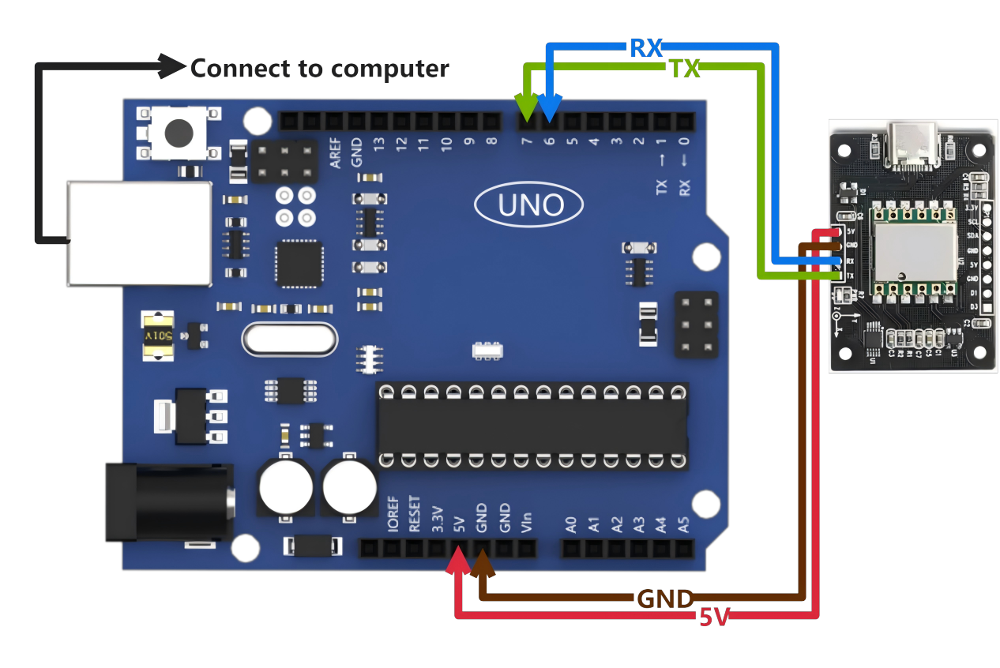

# 2. IMU Application Instructions-Basic Application

## 2.1 STM32F103-Serial Port Application Routines

This routine utilizes the STM32F103C8T6 chip development board, referred to as STM32 for demonstration convenience.

Preparation of the following products is required: a Win10/Win11 computer, an IMU module (with wired data interface), a micro-USB data cable, a CH340 module, and several DuPont cables.

### 2.1.1 Preparation

Connect the STM32's serial port 1 to the CH340 module, and insert the CH340 module into the USB port of the Win10 computer. Connect the STM32's serial port 2 to the serial port interface of the IMU module.

Use the micro-USB data cable to power the `STM32` by connecting it to the `STM32` and the USB port of the computer.

* **Wiring Instructions**

STM32	 IMU

VCC   ------> VCC

GND  ------> GND

PA10 <------ TXD


### 2.1.2 Case Development

[Source Code](https://drive.google.com/drive/folders/1-9gHCo9N8SOaOJli2f6GnFgSXFPrG3Dr?usp=sharing)

Connect the STM32's serial port 1 to the CH340 module, and insert the CH340 module into the USB port of the Win10 computer. Connect the STM32's serial port 2 to the serial port interface of the IMU module.

Use the micro-USB data cable to power the STM32 by connecting it to the STM32 and the USB port of the computer.

Wiring Instructions:

{lineno-start=47}
```c
	Usart1Init(115200);
	Usart2Init(9600);
```

Read and print the data of the IMU module.

{lineno-start=55}

```c
	while (1)
	{
		CmdProcess();
		if(s_cDataUpdate)
		{
			for(i = 0; i < 3; i++)
			{
				fAcc[i] = sReg[AX+i] / 32768.0f * 16.0f;
				fGyro[i] = sReg[GX+i] / 32768.0f * 2000.0f;
			}
			if(sReg[TEMP] - sReg[Roll] > 10 | sReg[Roll] - sReg[TEMP] > 10)
			{
				fAngle[0] = sReg[Roll] / 32768.0f * 180.0f;
				fAngle_tmp = fAngle[0];
			}
			else   fAngle[0] = fAngle_tmp;
			
			for(i = 1; i<3;i++)
			{
				fAngle[i] = sReg[Roll+i] / 32768.0f * 180.0f;
			}

			if(s_cDataUpdate & ACC_UPDATE)
			{
				printf("acc:%.3f %.3f %.3f\r\n", fAcc[0], fAcc[1], fAcc[2]);
				s_cDataUpdate &= ~ACC_UPDATE;
			}
			if(s_cDataUpdate & GYRO_UPDATE)
			{
				printf("gyro:%.3f %.3f %.3f\r\n", fGyro[0], fGyro[1], fGyro[2]);
				s_cDataUpdate &= ~GYRO_UPDATE;
			}
			if(s_cDataUpdate & ANGLE_UPDATE)
			{
				printf("angle:%.3f %.3f %.3f\r\n", fAngle[0], fAngle[1], fAngle[2]);
				s_cDataUpdate &= ~ANGLE_UPDATE;
			}
			if(s_cDataUpdate & MAG_UPDATE)
			{
				printf("mag:%d %d %d\r\n", sReg[HX], sReg[HY], sReg[HZ]);
				s_cDataUpdate &= ~MAG_UPDATE;
			}
		}
	}
```

### 2.1.3 Program Outcome

After downloading the program and connecting to the `STM32`, open the serial port assistant (with configuration parameters shown in the figure below). You will observe continuous printing of data from the IMU module. When we alter the attitude of the IMU module, the data will also change accordingly.


## 2.2 STM32F407-Serial Port Application Routine

This routine utilizes the `STM32F407C8T6` chip development board, referred to as `STM32` for demonstration convenience.

Preparation of the following products is required: a Win10/Win11 computer, an IMU module (with wired data interface), a micro-USB data cable, a CH340 module, and several DuPont cables.

### 2.2.1 Preparation

Connect the `STM32`'s serial port to the USB port of the computer. Connect the `STM32`'s serial port 2 to the serial port interface of the IMU module.

Use the micro-USB data cable to power the `STM32` by connecting it to the `STM32` and the USB port of the computer.

* **Wiring instructions**

STM32       IMU

5V     ------> 5V

GND  -----> GND

PA3  <------ TXD


### 2.2.2 Case Development

Please refer to the information section for the specific [source code](https://drive.google.com/drive/folders/1-9gHCo9N8SOaOJli2f6GnFgSXFPrG3Dr?usp=sharing).

This routine sets the baud rate for serial port printing to 115200 bps and the baud rate for connecting to the IMU module to 9600. The baud rate of `STM32` serial port 2 can be adjusted based on the baud rate of the IMU module.

{lineno-start=84}
```c
void MX_USART1_UART_Init(void)
{

  /* USER CODE BEGIN USART1_Init 0 */

  /* USER CODE END USART1_Init 0 */

  /* USER CODE BEGIN USART1_Init 1 */

  /* USER CODE END USART1_Init 1 */
  huart1.Instance = USART1;
  huart1.Init.BaudRate = 115200;
```

{lineno-start=112}
```
void MX_USART2_UART_Init(void)
{

  /* USER CODE BEGIN USART2_Init 0 */

  /* USER CODE END USART2_Init 0 */

  /* USER CODE BEGIN USART2_Init 1 */

  /* USER CODE END USART2_Init 1 */
  huart2.Instance = USART2;
  huart2.Init.BaudRate = 9600;
```

Read and print the data of the IMU module.

{lineno-start=130}
```c
  while (1)
  {
    CmdProcess();
    if(s_cDataUpdate)
    {
        for(i = 0; i < 3; i++)
        {
            fAcc[i] = sReg[AX+i] / 32768.0f * 16.0f;
            fGyro[i] = sReg[GX+i] / 32768.0f * 2000.0f;
        }
        if(sReg[TEMP] - sReg[Roll] > 10 | sReg[Roll] - sReg[TEMP] > 10)
        {
            fAngle[0] = sReg[Roll] / 32768.0f * 180.0f;
            fAngle_tmp = fAngle[0];
        }
        else   fAngle[0] = fAngle_tmp;

        for(i = 1; i<3;i++)
        {
            fAngle[i] = sReg[Roll+i] / 32768.0f * 180.0f;
        }

        if(s_cDataUpdate & ACC_UPDATE)
        {
            printf("acc:%.3f %.3f %.3f\r\n", fAcc[0], fAcc[1], fAcc[2]);
            s_cDataUpdate &= ~ACC_UPDATE;
        }
        if(s_cDataUpdate & GYRO_UPDATE)
        {
            printf("gyro:%.3f %.3f %.3f\r\n", fGyro[0], fGyro[1], fGyro[2]);
            s_cDataUpdate &= ~GYRO_UPDATE;
        }
        if(s_cDataUpdate & ANGLE_UPDATE)
        {
            printf("angle:%.3f %.3f %.3f\r\n", fAngle[0], fAngle[1], fAngle[2]);
            s_cDataUpdate &= ~ANGLE_UPDATE;
        }
        if(s_cDataUpdate & MAG_UPDATE)
        {
            printf("mag:%d %d %d\r\n", sReg[HX], sReg[HY], sReg[HZ]);
            s_cDataUpdate &= ~MAG_UPDATE;
        }
    }
```

### 2.2.3 Program Outcome

After downloading the program and connecting to the `STM32`, open the serial port assistant (with configuration parameters shown in the figure below). You will observe continuous printing of data from the IMU module. As we change the attitude of the IMU module, the data will also change accordingly.


## 2.3 STM32-IIC Application Routine

This routine employs the `STM32F103C8T6` chip development board, referred to as `STM32` for demonstration convenience.

The following products are required for preparation: a Win10/Win11 computer, an IMU module (with wired data interface), a micro-USB data cable, a CH340 module, and some DuPont cables.

### 2.3.1 Preparation

Connect the `STM32`'s serial port 1 to the CH340 module, and insert the CH340 module into the USB port of the Win10 computer. Connect the `STM32`'s serial port 2 to the serial port interface of the IMU module.

Power the `STM32` by connecting the micro-USB data cable to the `STM32` and the USB port of the computer.


### 2.3.2 Case Development

Please refer to the specific [source code](https://drive.google.com/drive/folders/1-9gHCo9N8SOaOJli2f6GnFgSXFPrG3Dr?usp=sharing) provided in the information.

In this example, the baud rate has been set to `115200` bps. Note that this baud rate refers to the baud rate of the `STM32` serial port, not the baud rate of the IMU module.

{lineno-start=43}
```c
	Usart1Init(115200);
```

Another important parameter to note is the I2C address of the IMU module, which is defaulted to `0x50`. If you modify the address to another value, please remember to update this parameter accordingly.

{lineno-start=44}
```c
	IIC_Init();
	WitInit(WIT_PROTOCOL_I2C, 0x50);
```

The code loops to read and print data from the IMU module.

{lineno-start=52}
```c
	while (1)
	{
		WitReadReg(AX, 12);
		delay_ms(500);
		CmdProcess();
		if (s_cDataUpdate)
		{
			for (i = 0; i < 3; i++)
			{
				fAcc[i] = sReg[AX + i] / 32768.0f * 16.0f;
				fGyro[i] = sReg[GX + i] / 32768.0f * 2000.0f;
				fAngle[i] = sReg[Roll + i] / 32768.0f * 180.0f;
			}
			if (s_cDataUpdate & ACC_UPDATE)
			{
				printf("acc:%.3f %.3f %.3f\r\n", fAcc[0], fAcc[1], fAcc[2]);
				s_cDataUpdate &= ~ACC_UPDATE;
			}
			if (s_cDataUpdate & GYRO_UPDATE)
			{
				printf("gyro:%.3f %.3f %.3f\r\n", fGyro[0], fGyro[1], fGyro[2]);
				s_cDataUpdate &= ~GYRO_UPDATE;
			}
			if (s_cDataUpdate & ANGLE_UPDATE)
			{
				printf("angle:%.3f %.3f %.3f\r\n", fAngle[0], fAngle[1], fAngle[2]);
				s_cDataUpdate &= ~ANGLE_UPDATE;
			}
			if (s_cDataUpdate & MAG_UPDATE)
			{
				printf("mag:%d %d %d\r\n", sReg[HX], sReg[HY], sReg[HZ]);
				s_cDataUpdate &= ~MAG_UPDATE;
			}
		}
	}
}
```

### 2.3.3 Program Outcome

After downloading the program and connecting to the `STM32`, open the serial port assistant with the configuration parameters shown in the figure below. You will observe continuous printing of data from the IMU module. As we change the attitude of the IMU module, the data will also change accordingly.


## 2.4 Raspberry Pi-USB Application Routines

Products required for preparation: a Win10 or Win11 computer, an IMU module, a Type-C data cable, and a Raspberry Pi development kit.

### 2.4.1 Preparation

* **Hardware Connection**

Connect the IMU module to the USB port of the Raspberry Pi using Type-C data cable.


* **Install Serial Port Driver Library**

If the serial port driver library is not installed in Python 3, please execute the following command to install it:

```bash
pip3 install pyserial
```

To verify the installation, enter the command to check whether the serial port driver library is installed. Successful installation will list `pyserial` along with its version number.

```bash
pip3 list | grep pyserial
```


### 2.4.2 Case Development

Please refer to the specific [source code](https://drive.google.com/drive/folders/1-9gHCo9N8SOaOJli2f6GnFgSXFPrG3Dr?usp=sharing) provided in the information.

If more than one USB device is connected, ensure to verify the USB device number of the IMU module and adjust the port value accordingly. The baud rate for USB communication has been set to `baud=9600` in the program. Adjust the baud value as per the baud rate of the IMU module.

{lineno-start=143}
```python
if __name__ == '__main__':
    port = '/dev/ttyUSB0' # USB serial port 
    baud = 9600   # Same baud rate as the INERTIAL navigation module
    ser = serial.Serial(port, baud, timeout=0.5)
    print("Serial is Opened:", ser.is_open)
    while(1):
        datahex = ser.read(33)
        DueData(datahex)
```

Enter the command to identify the serial port number after plugging and unplugging the USB data cable. The serial port number is typically `ttyUSB0`. If the port number differs from the one specified in the `imu_usb.py` program, make the necessary adjustments. The symbol for `ttyUSB0` indicates the port number.

```bash
ls /dev/ttyUSB*
```

Upon plugging in the USB, confirm that the serial port number is `ttyUSB0`.


When unplugged, no serial number will be displayed.


### 2.4.3 Program Outcome

To incorporate the `imu_usb.py` file into the system, follow these steps:

(1) Import the `imu_usb.py` file into the system.

(2) Open the terminal.

(3) Navigate to the directory where the `imu_usb.py` file is located.

(4) Execute the following command:

```bash
python3 imu_usb.py
```

This will initiate the printing of data from the IMU module in the terminal. As the attitude of the IMU module changes, the data displayed will update accordingly.


## 2.5 Jetson Nano-USB Application Routines

You need to prepare the following items: Win10 computer, inertia module, Type-C cable, Jetson Nano development kit.

### 2.5.1 Preparation

* **Hardware Connection**

Connect the inertia module to the USB port of Jetson Nano using Type-C data cable.


* **Install Serial Driver Library**

Run the command to check whether the serial driver library is installed. If the serial driver library is installed, the word `pyserial` and its version will be printed.

```bash
pip3 list | grep pyserial
```


If the serial driver library is not installed, please run the following command:

```bash
pip3 install pyserial
```

### 2.5.2 Case Development

Please refer to the source code provided in the specific information for the code.

If multiple USB devices are connected, please verify and confirm the USB device number assigned to the inertial navigation module, and adjust the port value accordingly in the program. The program has been configured with a baud rate of 9600 for USB communication. Adjust the baud value to match the baud rate of the inertial navigation module as needed.

{lineno-start=143}
```python
if __name__ == '__main__':
    port = '/dev/ttyUSB0' # USB serial port 
    baud = 9600   # Same baud rate as the INERTIAL navigation module
    ser = serial.Serial(port, baud, timeout=0.5)
    print("Serial is Opened:", ser.is_open)
    while(1):
        datahex = ser.read(33)
        DueData(datahex)
```

Execute the command to list the available serial port devices. Then, disconnect the USB cable to identify the assigned serial port number. In this scenario, the serial port number is identified as `ttyUSB1`.

```bash
ll /dev/ttyUSB*
```


Update the symbol representing `ttyUSB1` in the `imu_usb.py` program accordingly.


### 2.5.3 Program Outcome

To integrate the `imu_usb.py` file into your system, follow these steps:

(1) Import the `imu_usb.py` file into the system.

(2) Open the terminal.

(3) Navigate to the directory containing the `imu_usb.py` file.

(4) Execute the following command:

```bash
python3 imu_usb.py
```

This will initiate continuous printing of data from the inertial navigation module in the terminal. As the attitude of the inertial navigation module changes, the displayed data will update accordingly.


## 2.6 Arduino-Serial Port Application Routines

This procedure utilizes the `Arduino UNO` development board. For the sake of clarity, the following references to hardware and components will be made with regards to Arduino.

Required items for preparation include: a Windows 10/11 computer, an IMU module (with wired data interface), and several DuPont cables.

### 2.6.1 Preparation

Connect the Arduino programming cable to the computer. Then, link the Arduino's serial port to the serial port interface of the IMU module.

* **Instructions for wiring**

Arduino     IMU

5V     ------> 5V

GND ------> GND

IO7  <------ TXD

IO6  <------ RXD



### 2.6.2 Case Development

Please refer to the [source code](https://drive.google.com/drive/folders/1-9gHCo9N8SOaOJli2f6GnFgSXFPrG3Dr?usp=sharing) provided in the specific information for the code.

This script configures the baud rate for serial port printing to 115200 bps and sets the baud rate for connecting to the IMU module to 9600. You can adjust the baud rate of the Arduino serial port to match the baud rate of the IMU module.

{lineno-start=41}
```c++
  IMU_Serial.begin(9600);
  Serial.begin(115200);
```

The script reads and prints data from the IMU module.

{lineno-start=60}
```c++
  while(len--)
  {
    WitSerialDataIn((char)IMU_Serial.read());
  }
  if(AutoScanSensor())
  {
     
    CmdProcess();
    if(s_cDataUpdate)
    {
      for(i = 0; i < 3; i++)
      {
        fAcc[i] = sReg[AX+i] / 32768.0f * 16.0f;
        fGyro[i] = sReg[GX+i] / 32768.0f * 2000.0f;
      }
      if(sReg[TEMP] - sReg[Roll] > 10 | sReg[Roll] - sReg[TEMP] > 10)
      {
        fAngle[0] = sReg[Roll] / 32768.0f * 180.0f;
        fAngle_tmp = fAngle[0];
      }
      else   fAngle[0] = fAngle_tmp;
      
      for(i = 1; i<3;i++)
      {
        fAngle[i] = sReg[Roll+i] / 32768.0f * 180.0f;
      }

      if(s_cDataUpdate & ACC_UPDATE)
      {
        Serial.print("acc: ");
        Serial.print(fAcc[0]);
        Serial.print(" ");
        Serial.print(fAcc[1]);
        Serial.print(" ");
        Serial.println(fAcc[2]);
        s_cDataUpdate &= ~ACC_UPDATE;
      }
      if(s_cDataUpdate & GYRO_UPDATE)
      {
        Serial.print("gyro: ");
        Serial.print(fGyro[0]);
        Serial.print(" ");
        Serial.print(fGyro[1]);
        Serial.print(" ");
        Serial.println(fGyro[2]);
        s_cDataUpdate &= ~GYRO_UPDATE;
      }
```

### 2.6.3 Program Outcome

After uploading the program to the Arduino board, launch the serial port monitor from the toolbar (as illustrated below). Ensure that the baud rate is set to 115200. You'll observe continuous printing of IMU module data. As you manipulate the attitude of the IMU module, the data will dynamically update.


## 2.7 Arduino-IIC Application Routines

This procedure utilizes the Arduino UNO development board. For demonstration purposes, the term **"Arduino"** will be used.

Required items for preparation include: a Windows 10/11 computer, an IMU module (with a wired data interface), a type-C data cable, and several DuPont cables.

### 2.7.1 Preparation

Connect the Arduino programming cable to the computer. Then, interface the Arduino with the I2C interface of the IMU module.

* **Here are the wiring instructions**

Arduino     IMU

GND ------> GND

D6    ------> SDA

D7    ------> SCL


### 2.7.2 Case Development

Please refer to the information section for the specific source code.

In this example, the baud rate has been configured to 115200 bps. It's essential to note that this baud rate refers to the baud rate used by the Arduino serial port, not the baud rate of the IMU module.

{lineno-start=39}
```c++
  Serial.begin(115200);
```

Another important consideration is the I2C address of the IMU module. The default address is typically set to `0x50`. If you have modified the address to something else, ensure to update this parameter accordingly in the code.

{lineno-start=40}
```c++
  IIC_Init();
  WitInit(WIT_PROTOCOL_I2C, 0x50);
```

Read and print the data of the IMU module in a loop.

{lineno-start=50}
```c++
void loop() {
  // put your main code here, to run repeatedly:
  float fAcc[3], fGyro[3], fAngle[3];
  int i;
  WitReadReg(AX, 12);
  delay(500);
  CmdProcess();
  if (s_cDataUpdate)
  {
    for (i = 0; i < 3; i++)
    {
      fAcc[i] = sReg[AX + i] / 32768.0f * 16.0f;
      fGyro[i] = sReg[GX + i] / 32768.0f * 2000.0f;
      fAngle[i] = sReg[Roll + i] / 32768.0f * 180.0f;
    }
    if (s_cDataUpdate & ACC_UPDATE)
    {
      Serial.print("acc: ");
      Serial.print(fAcc[0]);
      Serial.print(" ");
      Serial.print(fAcc[1]);
      Serial.print(" ");
      Serial.println(fAcc[2]);
      s_cDataUpdate &= ~ACC_UPDATE;
    }
    if (s_cDataUpdate & GYRO_UPDATE)
    {
      Serial.print("gyro: ");
```

### 2.7.3 Program Outcome

Once you have uploaded the program to the Arduino, open the serial port monitor from the toolbar (as depicted in the figure below). Ensure that the baud rate is set to 115200. You will observe continuous printing of data from the IMU module. As you adjust the attitude of the IMU module, the displayed data will dynamically update.

