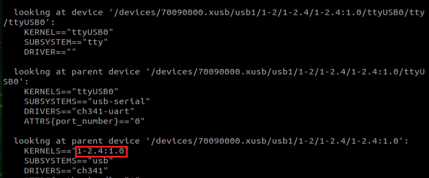

# 3. IMU Application Instructions-ROS Application

## 3.1 ROS1 Application Instructions

### 3.1.1 ROS Environment Installation, System Installation & Environment Setup

By default, this routine assumes that the ROS development environment is already installed on your system. If ROS is not installed, please install it manually before proceeding with this routine.
To install the necessary IMU data processing tools and visualization tools, please run the corresponding command in the terminal based on your Ubuntu version and ROS distribution:

(1) For Ubuntu 16.04 with ROS Kinetic and Python 2:

Installing IMU data processing and visualization tools:

```bash
sudo apt-get install ros-kinetic-imu-tools ros-kinetic-rviz-imu-plugin
```

```bash
sudo apt-get install python-visual
```

(2) For Ubuntu 18.04 with ROS Melodic and Python 2:

Installing IMU data processing and visualization tools:

```bash
sudo apt-get install ros-melodic-imu-tools ros-melodic-rviz-imu-plugin
```

(3) For Ubuntu 20.04 with ROS Noetic and Python 3:

```bash
sudo apt-get install ros-noetic-imu-tools ros-noetic-rviz-imu-plugin
```

Additionally, install the serial port communication library:

```bash
pip3 install pyserial
```

(4) Finally, install the ROS serial port driver:

```bash
sudo apt-get install ros-$ROS_DISTRO-serial
```

The example provided below assumes Ubuntu 18.04 with ROS Melodic version. Adjust commands according to your specific Ubuntu and ROS versions.

### 3.1.2 Port Binding

* **Bind Port Number Automatically**

To begin, connect the IMU module to the USB port of your computer. Next, copy the sample program "**wit_ros_imu.zip**" provided in the information to your user directory. Then, execute the following command to decompress the archive:

```bash
unzip ros1_imu.zip
```

```bash
cd ~/wit_ros_imu
```

```
sudo bash bind_usb.sh
```

Afterwards, reconnect the USB connection of the IMU module by unplugging and plugging it back in. Then, verify if the port has been successfully bound by running the following command:

```bash
ll /dev/imu_usb
```

:::{Note}
If the previous operation does not display the bound port number, try the following steps:
* Plug and unplug the USB connector of the IMU module.
*  Run the command `lsusb` twice.
*  Check whether the Manufacturer ID and Product ID of the device are correct.
* Make the necessary adjustments in the [/home/hiwonder/wit_ros_imu/imu_usb.rules](https://drive.google.com/drive/folders/1-9gHCo9N8SOaOJli2f6GnFgSXFPrG3Dr?usp=sharing) file.
:::


After modification, execute the command:

```bash
sudo bash bind_usb.sh
```

* **Adjust the USB Device Number**

If the automatic port binding operation described above fails, you'll need to manually adjust the USB device number corresponding to the module. Follow these steps:

(1) To determine the USB port number associated with the inertial navigation module, follow these steps:

① Connect the inertial navigation module to the computer's USB port using a USB-typeC data cable.

② Open the terminal and execute the following command to detect the device port:

```bash
ls /dev/ttyUSB*
```

③ Observe the output before and after plugging in the inertial navigation module. The newly appeared port number after insertion is likely the one assigned to the module.

④ It's advisable to verify the port number again after rebooting the system to ensure accuracy.
In a scenario where the computer is connected to multiple USB devices, follow these steps:

⑤ Check the ports before inserting the inertial navigation module using the command:

```bash
ls /dev/ttyUSB*
```

⑥ Insert the inertial navigation module and re-run the command to check the ports again.

⑦ Compare the port numbers listed before and after insertion. The port number with the second-largest number in the second listing is likely the one assigned to the inertial navigation module.

This approach helps identify the correct USB device number for the inertial navigation module, especially in cases where multiple USB devices are connected to the computer.

(2) Change the parameter configuration, including USB port number.

```bash
cd ~/wit_ros_imu/launch
vim rviz_and_imu.launch
```

Navigate to the script directory [src/launch](https://drive.google.com/drive/folders/1-9gHCo9N8SOaOJli2f6GnFgSXFPrG3Dr?usp=sharing) and open the configuration parameters Locate the parameter for the device number, typically labeled as [/dev/ttyUSB0](https://drive.google.com/drive/folders/1-9gHCo9N8SOaOJli2f6GnFgSXFPrG3Dr?usp=sharing) (used by default in the script). If the number recognized by your computer differs from `USB0`, update it accordingly in the file.

:::{Note}
If multiple USB serial devices are connected, you might need to manually verify and modify the corresponding serial number each time you reboot the computer.
:::


Save the modification and close the file.

(3) If you encounter a USB permission issue, you can resolve it by executing the following command in the terminal to grant appropriate permissions or by adding the current user to the USB device permission list:

```bash
sudo chmod 777 /dev/ttyUSB0
```

### 3.1.3 IMU Software Use Instructions

* **Compile the Workspace**

Open the command-line terminal, and run the following command:

(1) Create new workspace directory:

```bash
mkdir ros1Imu_ws
```

(2) Navigate to this directory:

```bash
cd ros1Imu_ws
```

(3) Create `src` directory in the workspace where the ROS package is stored:

```bash
mkdir src
```

(4) Make sure you are in the root directory of your workspace

```bash
cd ~/ros1Imu_ws
```


(5) Initialize workspace

```bash
catkin_make
```

(6) Add permissions to `.py`

```bash
cd ~/ros1Imu_ws/src/ros_imu_ws/src/scripts
sudo chmod 777 *.py
```

(7) Add '`source ~/ros1Imu_ws/devel/setup.sh`' to the folder `~/.zshrc`.


Lastly, execute the command `source ~/.zshrc`.

* **Change Parameter Configuration**

Navigate to the directory `~/ros1Imu_ws/src/wit_ros_imu/launch/` and modify the relevant parameters in the file "`rviz_and_imu.launch`". By default, the baud rate is set to 9600. If you have modified the baud rate through the host computer, ensure to update it in the launch file accordingly. Use the following commands to navigate to the directory and edit the file:

```bash
cd ~/ros1Imu_ws/src/wit_ros_imu/launch
vim rviz_and_imu.launch
```

Go to the src/launch directory and open the rviz_and_imu.launch file to configure the parameters.


* **Enter Visualization Interface**

(1) Terminate the app service by executing the command. In the provided robot image, it's necessary to disable the mobile app service. (If the virtual machine image does not have any auto-starting services, you can skip this command.)

```bash
sudo systemctl stop start_app_node.service
```

(2) Open the terminal and execute the launch file. It's important to note that this action must be performed on the actual desktop or via VNC remote desktop. Running the launch file is not possible through an SSH remote terminal.

```bash
roslaunch wit_ros_imu rviz_and_imu.launch
```

(3) Select the /imu/data topic and observe the model's motion response.


Open two new terminals, then respectively execute the following commands to check the data with `rostopic echo`:

```bash
rostopic echo /wit/mag
rostopic echo /imu/data
```

If the driver runs successfully, the terminal will output the message below:


## 3.2 ROS2 Application Routine

* **Environment Setup**

This tutorial covers the setup process for a ten-axis IMU module environment in ROS 2, including compiling function packages, binding serial ports, running programs, and viewing data. The instructions provided here are based on Ubuntu 20.04 with ROS Foxy. The workspace name used in this example is **"ros1_ws"**, and the default baud rate is set to 9600.

### 3.2.1 Port Binding

* **Bind Port Number Automatically**

First, connect the IMU module to the USB port of your computer. Then, copy the sample program "**ros_imu_ws.zip**" provided in the information to your user directory. Finally, run the following command to decompress the zip file:

```bash
unzip wit_ros2_imu.zip
```

```bash
cd ~/wit_ro2s_imu
```

```
sudo bash bind_usb.sh
```

Disconnect and reconnect the USB cable. Then, verify if the port has been successfully bound by running the following command:

```bash
ll /dev/imu_usb
```

:::{Note}
If the previous steps do not display the bound port number, plug and unplug the USB connector, then enter the `lsusb` command twice to verify. Check whether the manufacturer ID and product ID of the device are correct. Make the necessary changes to the [~/ros2_ws/src/wit_ros2_imu/imu_usb.rules](https://drive.google.com/drive/folders/1-9gHCo9N8SOaOJli2f6GnFgSXFPrG3Dr?usp=sharing) file accordingly.
:::


:::{Note}

After modifying the device ID and port number, you need to reload the udev rules using the following commands:

```
sudo udevadm control --reload-rules
```

```
sudo udevadm trigger
```

:::

* **Adjust the USB Device Number**

If the automatic port binding operation described above fails, you'll need to manually modify the USB device number corresponding to the module. Follow these steps:

(1) Check the USB port number by connecting the inertial navigation module to the USB port of the computer using a USB-typeC data cable. Open the terminal and enter the following command to detect the device port:

```bash
ls /dev/ttyUSB*
```

Note the port numbers listed before and after plugging in the inertial navigation module. The newly appeared port number after insertion is likely the one assigned to the module.

It's advisable to reconfirm the port number after rebooting the system to ensure accuracy.

In a scenario where the computer is connected to multiple USB devices, follow these steps:

① Before inserting the inertial navigation module, check the ports by running the command:

```bash
ls /dev/ttyUSB*
```

② After inserting the inertial navigation module, re-run the command to check the ports again.

③ Compare the port numbers listed before and after insertion. The port number with the second-largest number in the second listing is likely the one assigned to the inertial navigation module.

(2) To modify parameter configuration, follow these steps:

① Navigate to the script directory:

```bash
cd ~/wit_ros2_imu/launch
```

② Open the configuration file "`rviz_and_imu.launch.py`" using a text editor like Vim:

```bash
vim rviz_and_imu.launch.py
```

③ Locate the parameter for the USB port number (usually labeled as '`/dev/ttyUSB0`' by default) and adjust it to match the port number recognized by your computer.

④ Save the changes after modifying the file.

:::{Note}
If multiple USB serial devices are connected, you may need to manually verify and modify the corresponding serial number each time you turn on the computer.
:::


Having finished modification, save the change and close the file.

(3) In case of a USB permission problem, you can resolve it by entering the following command in the terminal to grant permissions or by adding the current user to the USB device permission list:

```bash
sudo chmod 777 /dev/ttyUSB0
```

### 3.2.2 Feature Package Use Instructions

* **Compile Workspace**

(1) Create a workspace named **"ros_ws"** and a new **"src"** folder within this directory to store the function package. Execute the following commands in the terminal:

```bash
mkdir ros_ws
cd ros_ws
mkdir src
```

(2) Next, unzip the file to obtain the **"wit_ros2_imu"** folder. Copy this folder to the newly created **"src"** directory. Then, return to the workspace directory and compile using the `colcon build` command:

```bash
cd ~/ros_ws
sudo colcon build
```

(3) After building the workspace, add the path of the workspace to the `.bashrc` file:

```bash
sudo vim ~/.bashrc
```

(4) Add the following line at the end of the file:

```source ~/ros1_ws/install/setup.bash
source ~/ros_ws/install/setup.bash
```

Save and exit the file. Replace "`~/ros_ws`" with the actual directory path to your workspace if it's different.

* **Change Parameter Configuration**

By default, the program uses a baud rate of 9600. If you have changed the baud rate on the PC software, you'll also need to update the source code accordingly in ~/ros_ws/src/wit_ros2_imu/launch. 

Find the baud rate setting and replace 9600 with the new value that matches the one set on the PC software. After making the change, save the file and exit. Finally, return to the workspace root directory and recompile the project.

In the file located at ~/ros_ws/src/wit_ros_imu/launch/rviz_and_imu.launch, you may update the corresponding parameters as needed. The baud rate (**baud**) should be set according to your actual configuration. By default, it is set to 9600. If you have changed the baud rate on the PC software, make sure to update this value to match the new setting.

To modify the baud rate in the source code, follow these steps:

(1) Navigate to the launch file directory:

```bash
cd ~/ros_ws/src/wit_ros2_imu/launch
```

(2) Open the file "`rviz_and_imu.launch.py`" using a text editor:

```bash
vim rviz_and_imu.launch.py
```

(3) Navigate to the src/launch directory and open the rviz_and_imu.launch.py file to check or modify the configuration parameters.

:::{Note}
* After making modifications to the program, it's essential to recompile it to ensure that the changes take effect. Use the following command to compile:

```
sudo colcon build
```

* To adjust directory permissions, use the following command:

```bash
sudo chmod -R 755 /path/ros_ws/src
```
:::

### 3.2.3 Testing

Install the required library before testing:

```bash
sudo pip install pyserial
```

Enter the following command in the terminal:

```bash
ros2 launch wit_ros2_imu rviz_and_imu.launch.py
```

Use the `ros2 topic echo` tool to view the specific content of the published data. Enter the following command in the terminal:

```bash
ros2 topic echo /imu/data_raw
```

The display is as shown in the figure below:


## 3.3 3.Integrating IMU and GPS Data 

### 3.3.1 Module Connection

This example uses the Jetson Nano as the controller. If you are using a PC virtual machine or a Raspberry Pi, you will need to check and adjust the corresponding device identifier numbers accordingly.


### 3.3.2 Port Identification

(1)  First, import the gps_ws and imu_ws packages onto the Jetson Nano desktop.

(2)  Open the terminal and enter the command lsusb to list connected USB devices and find the GPS and IMU modules' device IDs.


(3) As shown in the figure below, you may see that both modules share the same device ID. To distinguish them, you will use the USB bus address of each device. Start by connecting only the IMU module, then run command "**udevadm info -a -n /dev/ttyUSB***". You will see a unique identifier for the IMU module, "**1-2.3:1.0**" in this example.

```bash
udevadm info -a -n /dev/ttyUSB*
```

You can observe that the unique identifier of the device at this moment is "**1-2.4:1.0**".


(4) Next, disconnect the IMU and connect the GPS module. Run the same command again: udevadm info -a -n /dev/ttyUSB* 

You should now see a different unique identifier, such as "**1-2.4:1.0**".

```bash
udevadm info -a -n /dev/ttyUSB*
```



(5) Add device identification rules in the imu_usb.rules file. Enter the command "**sudo vim /etc/udev/rules.d/imu_usb.rules**" to edit the file. Then, enter the following content into the file:

```
SUBSYSTEM=="tty", KERNELS=="1-2.3:1.0", MODE:="0666",
SYMLINK+="imu_usb"
```

(6)  Add device identification rules in the gps.rules file. Enter the command "**sudo vim /etc/udev/rules.d/gps.rules**" to edit the file. Then, enter the following content into the file:

```
SUBSYSTEM=="tty", KERNELS=="1-2.4:1.0", MODE:="0666",
SYMLINK+="gps_serial"
```

(7) After making the changes, enter the following two commands to reload the udev rules and trigger the devices to be re-recognized:

```
sudo udevadm control --reload-rules       
sudo udevadm trigger
```

Connect both the IMU and GPS modules to verify:


Unplug the IMU module to verify:


Once everything is verified to be working correctly, proceed with the following steps.

### 3.3.3 Compile the Workspace

(1) Place both gps_ws and imu_ws workspaces in your home directory. Then, navigate to each workspace and compile using the following command:

```
catkin_make
```

(2) After compilation, add the following lines to your ~/.zshrc file:

```
source ~/imu_ws/devel/setup.sh
source ~/gps_ws/devel/setup.sh
```


(3) Finally, refresh the environment variables: source ~/.zshrc

### 3.3.4 IMU and GPS Data Fusion

This section demonstrates how to fuse IMU and GPS data, and visualize the result in RViz. Important Notes: 

(1) Make sure both the IMU and GPS modules are connected to the controller via two separate data cables.

(2) Two separate workspaces are required: gps_ws and imu_ws. Their source folders (gps_src and imu_src) are located in the current directory. After extracting gps_src, copy the contents inside its src folder into the src folder of gps_ws, then run catkin_make to compile. Similarly, after extracting imu_src, copy its src contents into the src folder of imu_ws, and compile it using catkin_make. You can refer to the gps_ws and imu_ws workspaces provided in the virtual machine for reference. 

(3) The default baud rate for both IMU and GPS modules is 9600.

Data fusion requires data from two topics: /imu/data and /fix. These topics can be obtained by launching the IMU and GPS modules. To start the fusion process, run the following command: roslaunch imu_gps_localization imu_gps_test.launch

```
roslaunch imu_gps_localization imu_gps_test.launch
```

(4) After launching, you may initially see a warning indicating that there's not enough IMU data. Just wait a few moments — the warning will disappear, and soon you'll see the fused path being printed. An example of the output is shown below: 


(5) The launch file includes the following components:


`nmea_serial_driver.launch`: Retrieves GPS data and publishes it to the `/fix` topic. `rviz_and_imu.launch`: Retrieves IMU data and publishes it to the `/imu/data` topic. `imu_gps_localization_node`: Subscribes to both `/fix` and /`imu/data`, performs the fusion process, and publishes the result to the `/fused_path` topic. You can check the list of active topics with rostopic list, or visualize the node connections using `rosrun rqt_graph rqt_graph`. A diagram of the topic relationships is shown below:

